<h1 style="font-weight: bold; color: black; font-size: 3em; margin-bottom: 5px;">
  Добро пожаловать в Screen Data
</h1>

Инструкция по использованию приложения для подписи чеков

Данное приложение предназначено для подписи чеков, чтобы в системе ваши чеки были подписаны следующим образом: <strong>логин личного кабинета + наименование устройства</strong>.

<h3 style="color: black; font-size: 1.5em; margin-top: 30px;">Пошаговая инструкция</h3>

<strong>1.</strong> Скачиваем APK-приложения, который вам отправит администратор.

  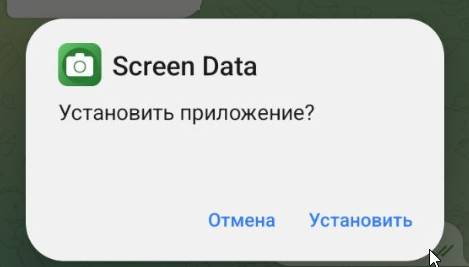

<strong>2.</strong> Устанавливаем приложение на устройство.

  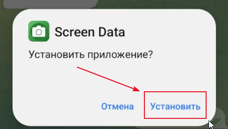

<strong>3.</strong> После этого переходим в настройки телефона, ищем «Специальные возможности», там будет Screen Data — тумблер будет отключён, его нужно включить. Если будет уведомление «Доступ для приложения запрещён» — переходим к следующим настройкам.

  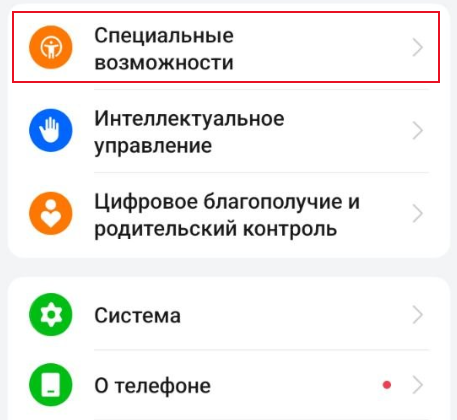
  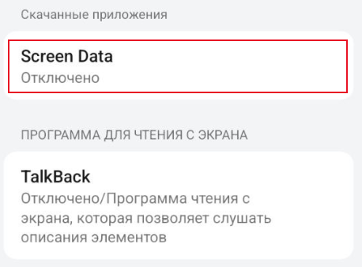
  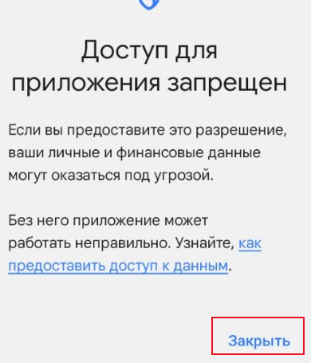

<strong>4.</strong> Переходим на главное меню телефона, находим приложение, зажимаем на него и нажимаем «О приложении».

  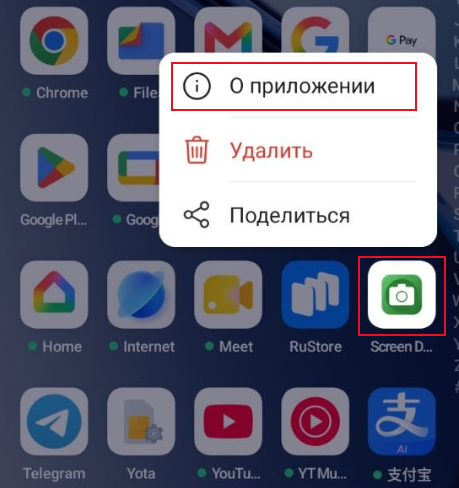

<strong>5.</strong> В правом верхнем углу нажимаем на три точки и нажимаем кнопку «Разрешить доступ к настройкам».

  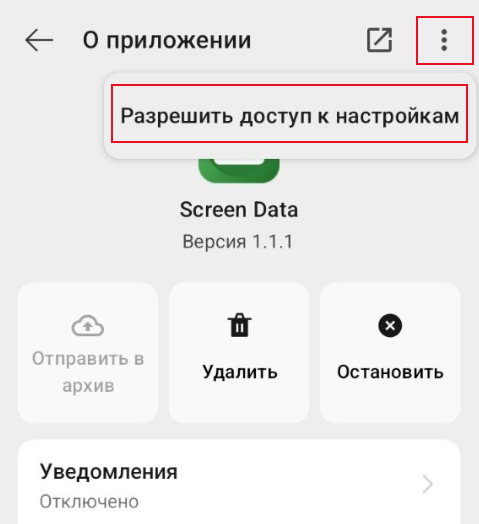

<strong>6.</strong> Тут же в настройках приложения спускаемся ниже и находим пункт «Поверх других приложений» — нажимаем «Разрешить».

  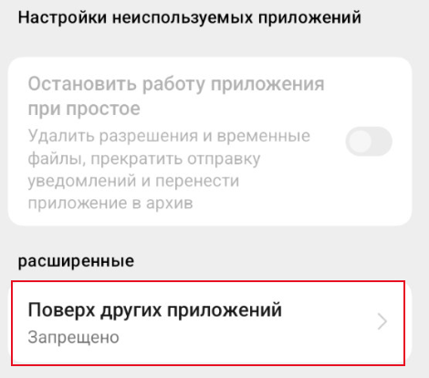

<strong>7.</strong> После этого возвращаемся в пункт 3 — включение спец. возможностей через настройки телефона. После того как мы включим Screen Data, заходим в само приложение.

  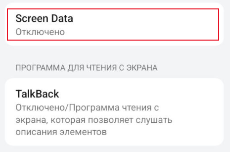
  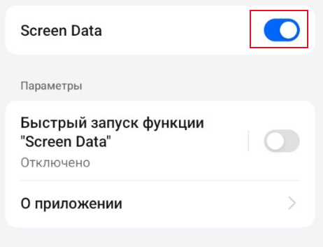
  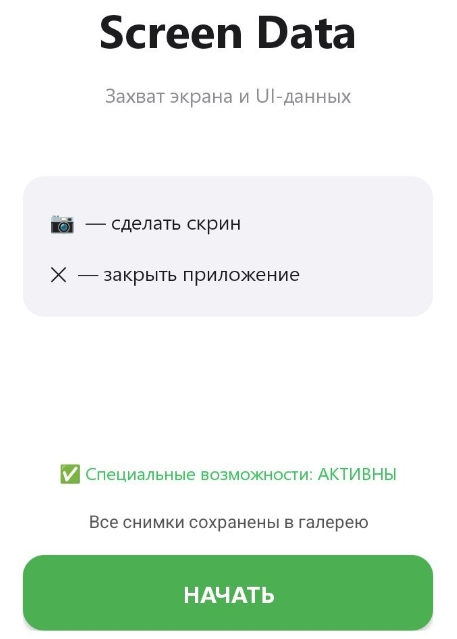

<strong>8.</strong> Когда мы зашли в приложение, у вас выйдет уведомление «Начать запись или трансляцию через приложение» — вы выбираете пункт «Весь экран», после нажимаете кнопку «Начать».

  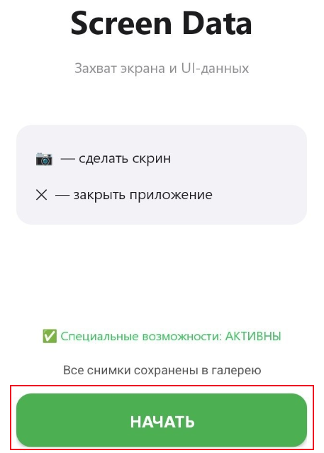
  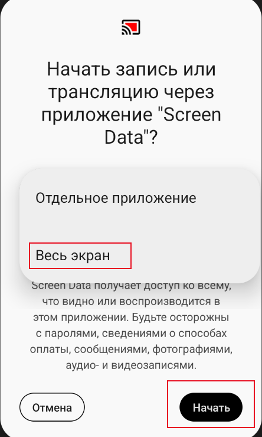

<strong>9.</strong> У вас появляются две кнопки на экране — одна зелёная, другая красная:

<ul style="color: black; font-size: 1.15em; padding-left: 20px;">
  <li><strong>Зелёная кнопка</strong> — отвечает за скриншот и отправку на сервер, а также сохраняет скриншот в галерею.</li>
  <li><strong>Красная кнопка</strong> — отвечает за прекращение работы приложения.</li>
</ul>

<strong>10.</strong> После всей этой настройки можем переходить к работе по выплатам.

<strong>11.</strong> Заходим в приложение банка, делаем выплату.

  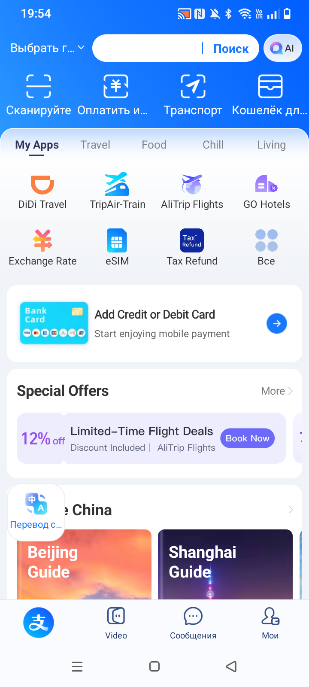

<strong>12.</strong> Делаем успешный скриншот транзакции, ждём, когда он отправится на сервер и сохранится в галерее.

  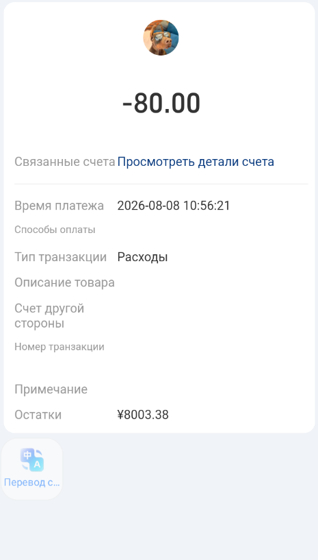

<strong>13.</strong> Заходим в личный кабинет по выплатам, загружаем скриншот из галереи и подтверждаем заявку.

  

    Отлично! Теперь вы знаете, как настроить приложение Screen Data и работать с ним.
  

