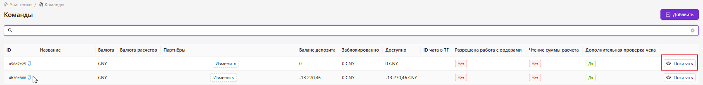
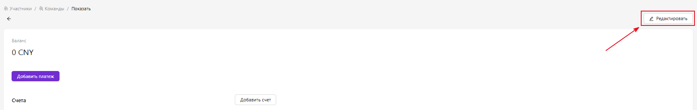
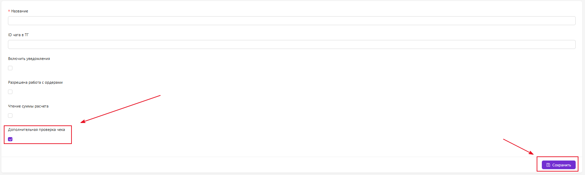
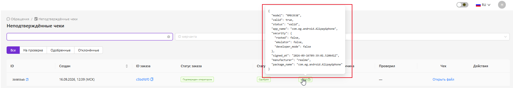

<h1 style="color: black; font-size: 2.2em; font-weight: bold; margin-bottom: 30px;">🔐 Инструкция подключения партнёра к подписи чеков</h1>

Данный раздел предназначен для администраторов. Здесь описано, как подключить команду к системе подписи чеков и как проверить, что всё работает корректно.

<h3 style="color: black; font-size: 1.5em; margin-top: 30px;">Пошаговая инструкция</h3>

<strong>1.</strong> Заходим в личный кабинет администратора.

<strong>2.</strong> Заходим в раздел «Команды».

<strong>3.</strong> Вводим в поиске название нужной команды, нажимаем «Показать».

  

<strong>4.</strong> Когда зашли в команду — нажимаем кнопку «Редактировать» справа в углу.

  

<strong>5.</strong> Ставим галочку на пункт «Дополнительная проверка чеков».

  

<strong>6.</strong> После этого пишем команде, что они могут начинать устанавливать приложение для подписи чеков.

<h3 style="color: black; font-size: 1.5em; margin-top: 30px;">Как проверить, работает ли подпись чеков</h3>

<strong>1.</strong> Заходим в раздел «Обращения».

<strong>2.</strong> Далее — «Неподтверждённые чеки».

<strong>3.</strong> Находим нужную команду по названию или по ID заявки.

<strong>4.</strong> Смотрим подпись.

  

  

    Готово! Партнёр подключён к системе подписи чеков, и вы можете убедиться, что всё работает корректно.
  

